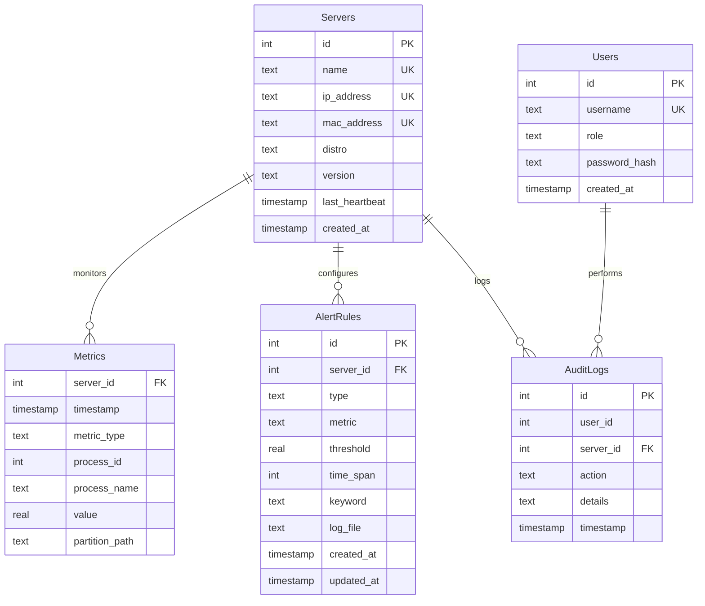

# Requirements Document: Linux Server Monitoring/Management Tool (Sauron)

## 1. Introduction
### Project Overview and Objectives
Project code name **Sauron** is a management and monitoring tool for Linux servers, designed to provide comprehensive oversight and control over server resources and operations. The tool aims to deliver real-time monitoring, alerting, and management capabilities to streamline server administration across multiple Linux distributions.

### Scope
- **Metrics Monitored (Initial, with future expansion)**:
  - CPU consumption: Overall and per application.
  - RAM consumption: Overall and per application.
  - Disk space: Initially partition-based, with planned expansion to per-application monitoring.
- **Log Monitoring**:
  - Non-critical for V1 due to existing tools (e.g., Azure Monitoring).
  - Near real-time (<1 minute) visibility into /var/log logs.
- **Alerting**:
  - Metrics-based alerts:
    - Maximum threshold triggers (e.g., CPU > 90%).
    - Average over user-defined time spans (e.g., AVG CPU > 70% over 5 minutes).
  - Log-based alerts:
    - Keyword-based (e.g., "ERROR" or regex).
    - Log file size thresholds (e.g., /var/log/app.log > 100MB).
- **Management**:
  - List all applications/processes on the server.
  - Remove, update, and install applications via package managers.
  - Manage repositories: Add, remove, list.
  - Perform tasks:
    - Manage cronjobs (create, edit, delete).
    - Manage files: Delete, download, rename, move, upload.
    - Manage directories: Create, move, delete.
    - Create symbolic links.
- **Supported Distributions (Versions TBD)**:
  - Ubuntu
  - CentOS
  - RedHat

## 2. Functional Requirements

### 2.1 Metrics Monitoring
- **FR-METRIC-01**: System shall monitor overall CPU consumption across all processes on the server.
- **FR-METRIC-02**: System shall monitor CPU consumption per application/process (identified by PID or name).
- **FR-METRIC-03**: System shall monitor overall RAM consumption (total, used, free).
- **FR-METRIC-04**: System shall monitor RAM consumption per application/process (e.g., VmRSS via /proc).
- **FR-METRIC-05**: System shall monitor disk space usage per partition (e.g., via statvfs or df).
- **FR-METRIC-06**: System shall support future expansion to monitor disk space usage per application (e.g., via app-specific paths or file descriptors).

### 2.2 Log Monitoring
- **FR-LOG-01**: System shall provide near real-time (<1 minute) visibility into logs stored in /var/log (e.g., via inotify or syslog API).
- **FR-LOG-02**: Log monitoring is non-critical for V1, as external tools (e.g., Azure Monitoring) can be used.

### 2.3 Alerting
- **FR-ALERT-01**: System shall allow users to configure alerts triggered when a monitored metric exceeds a user-defined maximum threshold (e.g., CPU > 90%).
- **FR-ALERT-02**: System shall support alerts based on the average value of a monitored metric over a user-defined time span (e.g., AVG CPU > 70% over 5 minutes).
- **FR-ALERT-03**: System shall enable keyword-based log alerts, scanning /var/log for user-specified patterns (e.g., "ERROR" or regex) in near real-time.
- **FR-ALERT-04**: System shall trigger alerts when log file size exceeds a user-defined threshold (e.g., /var/log/app.log > 100MB).

### 2.4 Management
- **FR-MGMT-01**: System shall list all running applications/processes on the server (e.g., via /proc or libproc2).
- **FR-MGMT-02**: System shall support removal of applications (e.g., via package managers like apt/yum).
- **FR-MGMT-03**: System shall support updating applications to newer versions.
- **FR-MGMT-04**: System shall support installation of new applications via package managers.
- **FR-MGMT-05**: System shall allow adding new repositories for package managers (e.g., apt sources.list or yum repos).
- **FR-MGMT-06**: System shall allow removing existing repositories.
- **FR-MGMT-07**: System shall list all configured repositories.
- **FR-MGMT-08**: System shall manage cronjobs (create, edit, delete via crontab).
- **FR-MGMT-09**: System shall manage files (delete, download, rename, move, upload) on the server filesystem.
- **FR-MGMT-10**: System shall support creating, moving, and deleting directories.
- **FR-MGMT-11**: System shall support creating symbolic links.

### 2.5 Supported Distributions
- **FR-DISTRO-01**: System shall support Ubuntu (version TBD).
- **FR-DISTRO-02**: System shall support CentOS (version TBD).
- **FR-DISTRO-03**: System shall support RedHat (version TBD).

## 3. Non-Functional Requirements

### 3.1 Performance
- **NFR-PERF-01**: System shall collect and process metrics with <5 seconds latency for real-time monitoring.
- **NFR-PERF-02**: Log monitoring shall achieve near real-time visibility (<1 minute latency) for /var/log updates.
- **NFR-PERF-03**: Management operations (e.g., install, remove, file operations) shall complete within 10 seconds for typical tasks, excluding network delays.

### 3.2 Scalability
- **NFR-SCALE-01**: System shall support monitoring and management of at least 100 servers concurrently.
- **NFR-SCALE-02**: Client application shall handle up to 1000 processes per server without significant performance degradation.

### 3.3 Reliability
- **NFR-REL-01**: System shall achieve 99.9% uptime for monitoring services, with failover mechanisms for critical components.
- **NFR-REL-02**: Client application shall handle transient errors (e.g., network failures) with retry logic and local buffering.

### 3.4 Security
- **NFR-SEC-01**: System shall use secure communication (TLS 1.3) for data in transit between client and server.
- **NFR-SEC-02**: System shall encrypt sensitive data at rest (e.g., credentials) using AES-256.
- **NFR-SEC-03**: System shall implement role-based access control (RBAC) with LDAP integration for user authentication.
- **NFR-SEC-04**: All management actions (e.g., file operations, application installs) shall be logged for auditing.

### 3.5 Compatibility
- **NFR-COMP-01**: Client application shall be compatible with Ubuntu, CentOS, and RedHat distributions (versions TBD).
- **NFR-COMP-02**: System shall integrate with standard Linux tools (e.g., apt, yum, crontab) for management tasks.

### 3.6 Usability
- **NFR-USE-01**: System shall provide a user-friendly interface (e.g., CLI or web dashboard) for configuring alerts and management tasks.
- **NFR-USE-02**: System shall include documentation for setup, configuration, and troubleshooting.

### 3.7 Maintainability
- **NFR-MAIN-01**: Client application shall be modular to support future extensions (e.g., per-application disk monitoring).
- **NFR-MAIN-02**: System shall include automated tests (unit and integration) to ensure code quality.

## 4. High-Level Architecture

### Components
- **Client Agent**: Lightweight C++ daemon deployed on each server (Ubuntu, CentOS, RedHat), responsible for collecting metrics (CPU, RAM, disk via /proc, statvfs), monitoring logs (/var/log via inotify), and executing management tasks (e.g., apt/yum, file operations).
- **Central Backend**: C++-based REST API server for metrics storage and management endpoints; stores metadata in SQLite and time-series data in a custom in-memory database optimized for time-series queries.
- **Central Dashboard**: Web interface built with Svelte (preferred for lightweight reactivity) or React, using Tailwind CSS for styling; visualizes metrics, logs, and alerts; supports configuration of alerts and management tasks via user-friendly forms and real-time charts.
- **Alerting Service**: Custom C++ module for evaluating metrics and logs against user-defined rules, integrated with the dashboard for alert configuration; triggers notifications via email or external APIs (e.g., ).

### Data Flow
- **Metrics**: Client agents collect metrics (CPU, RAM, disk) every 5 seconds, push to central backend via HTTPS.
- **Logs**: Agents monitor /var/log in near real-time (<1 min) using inotify, push filtered log events to backend for alerting.
- **Management**: Dashboard sends management commands (e.g., install app, manage files) to backend via REST API, relayed to agents via SSH or HTTPS.
- **Alerts**: Backend evaluates metrics/logs against user-defined rules (max threshold, average over time, keyword, log size); dashboard displays and configures alerts in real-time.

### Communication
- **Secure Channels**: TLS 1.3 for HTTP/HTTPS between agents, backend, and dashboard; SSH with key-based authentication for management tasks.
- **Internal**: Custom TCP-based protocol for high-throughput communication between backend services if needed.
- **Authentication**: JWT for dashboard access, RBAC with LDAP for user authorization.

## 5. Technical Implementation Details

### 5.1 Core Components
- **Client Agent**:
  - **Language**: C++17 for performance and portability.
  - **Metrics Collection**: Use `/proc/stat` for overall CPU, `/proc/<pid>/stat` for per-process CPU, `/proc/meminfo` for RAM, `/proc/<pid>/status` for per-process RAM, `statvfs()` for disk usage.
  - **Log Monitoring**: `inotify` (`<sys/inotify.h>`) for real-time /var/log monitoring; poll every 30 seconds for NRT (<1 min).
  - **Management**: Execute commands via `system()` or `popen()` for package managers (apt/yum), file operations via `<filesystem>`, cron via `crontab`, symlinks via `symlink()`.
  - **Packaging**: Compile as RPM/DEB for Ubuntu, CentOS, RedHat; install as systemd service.
- **Central Backend**:
  - **Language**: C++17 with Crow framework for REST API.
  - **Storage**: SQLite for metadata (server IPs, alert rules); custom in-memory time-series database (ring buffer) for metrics, supporting 5s granularity.
  - **Endpoints**: `/metrics/push` (POST), `/metrics/query` (GET), `/manage/{task}` (POST) for management tasks.
  - **Scalability**: Thread pool for concurrent request handling; sharding for >100 servers.
- **Central Dashboard**:
  - **Framework**: Svelte for lightweight, reactive UI (fallback: React with Tailwind CSS).
  - **Features**: Real-time charts for metrics (using Chart.js), log viewer, alert configuration forms, management task inputs (e.g., file upload, cron editor).
  - **Hosting**: Served via backend’s Crow server over HTTPS.
- **Alerting Service**:
  - **Implementation**: C++ module in backend; evaluates metrics against rules (max threshold, avg over time) every 10s; scans logs for keywords/size using regex (`<regex>`).
  - **Notifications**: SMTP for email, HTTP POST for ; configurable via dashboard.

### 5.2 Protocols and Integrations
- **Metrics**: Agents expose HTTP endpoint (`/metrics`) for push to backend; JSON format for data.
- **Logs**: Stream log events via HTTPS POST to backend; filter with regex for keywords.
- **Management**: SSH (libssh2) for secure command execution; REST API for dashboard-to-backend tasks.
- **Compatibility**: Use distro-specific package managers (apt for Ubuntu, yum for CentOS/RedHat); test on latest LTS versions.

### 5.3 Error Handling and Logging
- **Error Handling**: Retry failed API calls (exponential backoff, max 3 attempts); buffer metrics/logs locally on network failure (SQLite).
- **Logging**: Structured JSON logs via custom C++ logger; store in `/var/log/sauron` on agents and backend.
- **Auditing**: Log all management actions (user, action, timestamp) to SQLite.

### 5.4 Architecture Diagram
- **Description**: The diagram illustrates the flow of information across components:
  - **Client Agents**: Collect metrics/logs, push to backend via HTTPS, receive management commands via SSH/HTTPS.
  - **Central Backend**: Ingests metrics/logs, stores in SQLite/time-series DB, processes alerts, relays commands.
  - **Central Dashboard**: Queries backend for metrics/logs, configures alerts, initiates management tasks.
  - **Alerting Service**: Evaluates rules, sends notifications via email/.
- **Flow**:
  - Metrics: Agent → Backend (HTTPS push every 5s) → Time-series DB → Dashboard (query).
  - Logs: Agent → Backend (HTTPS push on change) → Alerting Service (keyword/size check) → Dashboard/Notifications.
  - Management: Dashboard → Backend (REST API) → Agent (SSH/HTTPS).
  - Alerts: Backend (rule evaluation) → Alerting Service → Email/.
- **Diagram** (Mermaid syntax):
  +-------------------+       +-------------------+       +-------------------+
  | Client Agent      | HTTPS | Central Backend   |       | Central Dashboard |
  | (C++ Daemon)      |------>| (C++ REST API)    |<------| (Svelte)          |
  | Metrics: CPU, RAM,|  push | SQLite: Metadata  | query | Charts, Alerts,   |
  | Disk, Logs        | every | Time-series DB    |   &   | Management UI     |
  | /var/log (inotify)| 5s    |                   |  cmd  |                   |
  +-------------------+       +-------------------+       +-------------------+
           |                        |                         |
           | SSH/HTTPS              |                         |
           | Commands               |                         |
           |                        | Alerts: SMTP/HTTP       |
           |                        |------------------------>|
           |                         +-------------------+    |
           |                         | Alerting Service |---->|
           |                         | (C++ Module)     |     | Email
           |                         +-------------------+    |
           +-------------------------------------------------+

### 5.5 Database Design

#### SQLite Schema (Metadata, Persistent)
1. **Servers**  
   - id (INTEGER PRIMARY KEY)  
   - name (TEXT UNIQUE)  
   - ip_address (TEXT UNIQUE)  
   - mac_address (TEXT UNIQUE)  
   - distro (TEXT)  # e.g., 'Ubuntu', 'CentOS', 'RedHat'  
   - version (TEXT)  
   - last_heartbeat (TIMESTAMP)  
   - created_at (TIMESTAMP DEFAULT CURRENT_TIMESTAMP)  

2. **AlertRules**  
   - id (INTEGER PRIMARY KEY)  
   - server_id (INTEGER FOREIGN KEY REFERENCES Servers(id))  
   - type (TEXT)  # e.g., 'metric_max', 'metric_avg', 'log_keyword', 'log_size'  
   - metric (TEXT)  # e.g., 'CPU', 'RAM', 'DISK'  
   - threshold (REAL)  
   - time_span (INTEGER)  # seconds, for avg alerts  
   - keyword (TEXT)  # for log alerts  
   - log_file (TEXT)  # e.g., '/var/log/app.log'  
   - created_at (TIMESTAMP DEFAULT CURRENT_TIMESTAMP)  
   - updated_at (TIMESTAMP)  

3. **AuditLogs**  
   - id (INTEGER PRIMARY KEY)  
   - user_id (INTEGER)  # user identifier for RBAC  
   - server_id (INTEGER FOREIGN KEY REFERENCES Servers(id))  
   - action (TEXT)  # e.g., 'install_app', 'delete_file'  
   - details (TEXT)  # JSON or description  
   - timestamp (TIMESTAMP DEFAULT CURRENT_TIMESTAMP)  

4. **Users**  
   - id (INTEGER PRIMARY KEY)  
   - username (TEXT UNIQUE)  
   - role (TEXT)  # e.g., 'admin', 'viewer'  
   - password_hash (TEXT)  # AES-256 encrypted  
   - created_at (TIMESTAMP DEFAULT CURRENT_TIMESTAMP)  

#### Time-Series Database (Metrics)
1. **Metrics**  
   - server_id (INTEGER)  # references Servers(id)  
   - timestamp (TIMESTAMP)  # Unix timestamp  
   - metric_type (TEXT)  # e.g., 'CPU_TOTAL', 'CPU_PROCESS', 'RAM_TOTAL', 'RAM_PROCESS', 'DISK_PARTITION'  
   - process_id (INTEGER)  # PID for per-process metrics, NULL for system-wide  
   - process_name (TEXT)  # optional, for per-process metrics  
   - value (REAL)  # e.g., CPU usage %, RAM MB, disk GB  
   - partition_path (TEXT)  # for disk metrics, e.g., '/'  
   - Storage: In-memory ring buffer with 5s granularity for real-time queries, flushed hourly to SQLite for historical lookup.  
   - Retention: Configurable, default 7 days.  

#### In-Memory Ring Buffer
- **Purpose**: Stores Metrics data in-memory for low-latency (<5s, NFR-PERF-01) real-time queries.  
- **Structure**: Per server/metric_type, a fixed-size std::vector<MetricEntry> (C++17). Each entry ~48-56 bytes: timestamp (8 bytes), metric_type (~12 bytes), value (8 bytes), process_id (~4 bytes + overhead), process_name (~12 bytes avg + overhead), partition_path (~12 bytes avg + overhead). Size = retention_seconds / 5 (e.g., 7 days = 1209600 slots, ~58-67MB/server/metric_type).  
- **Operations**: 
  - Push: Insert at head (modulo index); overwrite oldest data. Thread-safe via std::mutex.  
  - Query: Fetch entries by timestamp range and metric_type, mapped to indices via (timestamp - start_time) / 5s.  
  - Per-Process: Dynamic map<PID, ring_buffer> per metric_type, prune inactive PIDs after 1h.  
- **Memory Management**: 
  - Cap at 100 servers (NFR-SCALE-01, ~29-34GB for 5 metric types). Monitor via getrusage(); if >80% RAM, flush older entries to SQLite or reduce retention.  
  - Sharding: Distribute servers across backend instances (e.g., 25/instance) with load balancer.  
- **Persistence**: Hourly flush to SQLite via batch INSERT; load on restart.  

#### Sample C++ Ring Buffer Implementation
```cpp
#include <vector>
#include <mutex>
#include <optional>
#include <string>
#include <cstdint>

struct MetricEntry {
    int64_t timestamp;  // 8 bytes
    std::string metric_type;  // ~12 bytes avg + overhead
    double value;  // 8 bytes
    std::optional<int> process_id;  // ~4 bytes + overhead
    std::optional<std::string> process_name;  // ~12 bytes avg + overhead
    std::optional<std::string> partition_path;  // ~12 bytes avg + overhead
};

class RingBuffer {
private:
    std::vector<MetricEntry> buffer_;
    size_t head_ = 0;  // Next write position
    size_t size_;  // Fixed size (e.g., 1209600 for 7 days at 5s)
    std::mutex mutex_;
    int64_t start_time_ = 0;  // Earliest timestamp

public:
    RingBuffer(size_t size) : size_(size), buffer_(size) {}

    void push(const MetricEntry& entry) {
        std::lock_guard<std::mutex> lock(mutex_);
        if (buffer_[head_].timestamp == 0 && head_ == 0) {
            start_time_ = entry.timestamp;
        } else {
            start_time_ = entry.timestamp - ((size_ - head_) * 5);
        }
        buffer_[head_] = entry;
        head_ = (head_ + 1) % size_;
    }

    std::vector<MetricEntry> query(int64_t start, int64_t end, const std::string& metric_type = "") {
        std::lock_guard<std::mutex> lock(mutex_);
        std::vector<MetricEntry> results;
        for (size_t i = 0; i < size_; ++i) {
            size_t idx = (head_ + i) % size_;
            const auto& entry = buffer_[idx];
            if (entry.timestamp >= start && entry.timestamp <= end && entry.timestamp != 0) {
                if (metric_type.empty() || entry.metric_type == metric_type) {
                    results.push_back(entry);
                }
            }
        }
        return results;
    }
};

// Usage: std::map<std::pair<int, std::string>, RingBuffer> buffers; // {server_id, metric_type}
```

#### Sample Client Metrics JSON
**Full Snapshot**
```json
{
  "server_id": 1,
  "timestamp": 1763559623,
  "metrics": [
    {"metric_type": "CPU_TOTAL", "value": 75.5},
    {"metric_type": "RAM_TOTAL", "value": 4096.0},
    {"metric_type": "DISK_PARTITION", "value": 50.2, "partition_path": "/"},
    {"metric_type": "CPU_PROCESS", "process_id": 1234, "process_name": "nginx", "value": 20.1},
    {"metric_type": "CPU_PROCESS", "process_id": 5678, "process_name": "python3", "value": 15.3},
    {"metric_type": "RAM_PROCESS", "process_id": 1234, "process_name": "nginx", "value": 256.7},
    {"metric_type": "RAM_PROCESS", "process_id": 5678, "process_name": "python3", "value": 512.4}
  ]
}
```

**Partial Update**
```json
{
  "server_id": 1,
  "timestamp": 1763559628,
  "metrics": [
    {"metric_type": "CPU_TOTAL", "value": 80.0},
    {"metric_type": "CPU_PROCESS", "process_id": 1234, "process_name": "nginx", "value": 22.5}
  ]
}
```

#### Technical Implementation
- **SQLite (Metadata)**: Persistent disk-based DB (/path/to/db.sqlite) for Servers, AlertRules, AuditLogs, Users. Direct SQL CRUD, no in-memory buffer, low-frequency access.  
  - PRAGMA: journal_mode=WAL, synchronous=OFF, cache_size=-20000 (~20MB).  
  - Connection: Single persistent connection per backend instance.  
- **SQLite (Metrics Persistence)**: Hourly batch INSERT for Metrics; fallback for historical queries (>1h).  
  - SQL: `INSERT INTO Metrics (server_id, timestamp, metric_type, process_id, process_name, value, partition_path) VALUES (?, ?, ?, ?, ?, ?, ?);`  
- **Ring Buffer (Metrics)**:  
  - C++17 std::vector<MetricEntry> per server/metric_type.  
  - Push: O(1), thread-safe.  
  - Query: O(n) scan, optimized by timestamp index and metric_type filter.  
  - Memory: ~58-67MB/server/metric_type; cap at 100 servers (~29-34GB).  
  - Flush: Hourly to SQLite; clear flushed entries.  
- **Scalability**: Shard servers across backend instances; route by server_id. Monitor memory; evict oldest if >80% RAM.  
- **Historical Lookup**: Query in-memory first; fallback to SQLite for older data via `SELECT * FROM Metrics WHERE server_id = ? AND timestamp BETWEEN ? AND ? AND metric_type = ?`.  
- **Query Examples**:  
  - All processes CPU (in-memory): `buffers[{server_id, "CPU_PROCESS"}].query(start, end, "CPU_PROCESS")`  
  - CPU/Mem for processes + total CPU (1 day, in-memory):  
    ```cpp
    std::vector<MetricEntry> results;
    for (const auto& type : {"CPU_TOTAL", "CPU_PROCESS", "RAM_PROCESS"}) {
        auto entries = buffers[{server_id, type}].query(now - 86400, now, type);
        for (const auto& e : entries) {
            if (type == "CPU_TOTAL" || e.process_id == 1234 || e.process_id == 5678) {
                results.push_back(e);
            }
        }
    }
    ```  
  - SQLite (historical):  
    ```sql
    SELECT timestamp, metric_type, process_id, process_name, value
    FROM Metrics
    WHERE server_id = ? AND timestamp > ? - 86400
    AND metric_type IN ('CPU_TOTAL', 'CPU_PROCESS', 'RAM_PROCESS')
    AND (process_id IN (?, ?) OR metric_type = 'CPU_TOTAL');
    ```

#### Notes
- **Indexes**: Servers(ip_address, mac_address), AlertRules(server_id, type), AuditLogs(timestamp, server_id), Metrics(server_id, timestamp, metric_type).  
- **Performance**: In-memory ring buffer ensures <5s latency (NFR-PERF-01); SQLite for metadata/persistence.  
- **Security**: Encrypt password_hash with AES-256 (NFR-SEC-02).  
- **Scalability**: Sharding for >100 servers (NFR-SCALE-01).  
- **Logs**: Streamed via HTTPS, filtered in-memory for alerting (FR-LOG-01).  
- **Storage Contrast**: Metrics in ring buffer (real-time) and SQLite (historical); other tables (Servers, AlertRules, AuditLogs, Users) in persistent SQLite only, no in-memory buffer.

#### ER Diagram (Mermaid)
